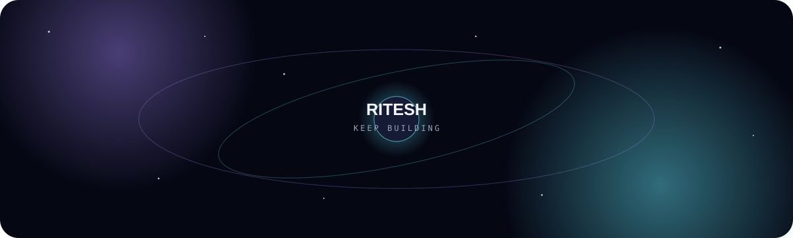

<div align="center">



# Ritesh Pandey

### Full-Stack Developer · Builder · Learner

I build practical web experiences, experiment with ideas, and learn by shipping.

[](./portfolio.html)
[](https://www.linkedin.com/in/ritesh-pandey-46a64528b)
[](mailto:riteshji289@gmail.com)

</div>

---

## ✦ About me

I’m a developer focused on turning ideas into clean, useful web products. My journey is still early, so this profile is intentionally about **real work, steady learning, and what I’m building next** rather than inflated numbers.

- 🧩 Building small full-stack and front-end projects
- 🌌 Exploring better UI, product thinking, and modern web development
- 🚀 Learning by taking ideas from concept → interface → working experience
- 📚 Growing my stack one project at a time

## 🪐 Featured work

### Journey
A personal development space and portfolio project that brings together experiments, UI work, and my progress as a developer.

**Explore:** [`portfolio.html`](./portfolio.html) · [`mindspace.html`](./mindspace.html)

### MindSpace
A mental-wellness journaling interface with mood tracking, dashboard-style views, breathing support, and privacy-focused UX concepts.

**Explore:** [`index.html`](./index.html) · [`styles.css`](./styles.css)

### Experiments
Small experiments are part of the journey too — including JavaScript and React work such as [`aap.js`](./aap.js) and [`BujoTransform.jsx`](./BujoTransform.jsx).

---

## ⚡ Tech I’m working with

<p>


</p>

## 🌠 Current direction

```text
Build → Break → Learn → Improve → Ship → Repeat
```

I’m aiming to become the kind of developer who can understand a problem, design a good experience, build the solution, and keep improving it after launch.

## 📈 The journey

This repository is intentionally a **living portfolio**. As I build more substantial projects, they’ll replace the experiments here and become the next stars in the collection.

> Small commits still count. The goal is not to look experienced — it’s to become experienced.

---

<div align="center">

### Find me around the web

**GitHub** · **LinkedIn** · **Email**

<sub>Built with curiosity, code, and a little cosmic energy ✦</sub>

</div>
